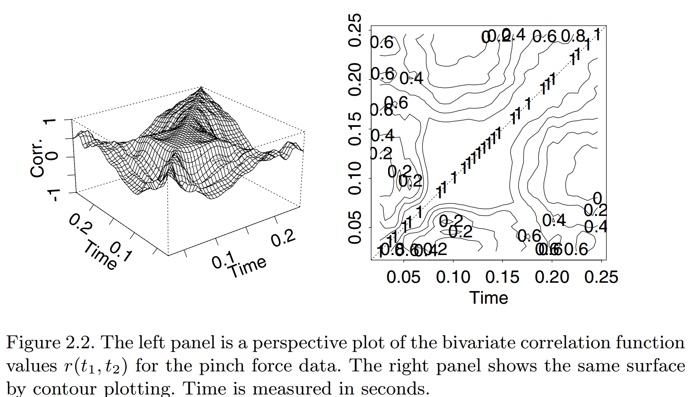
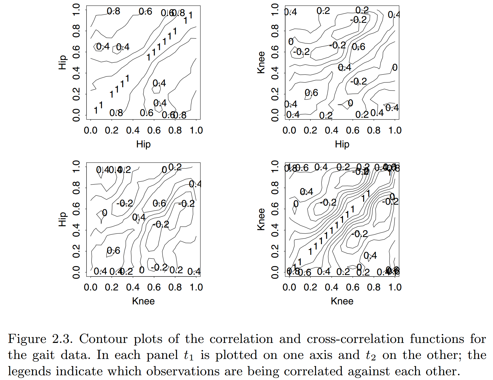
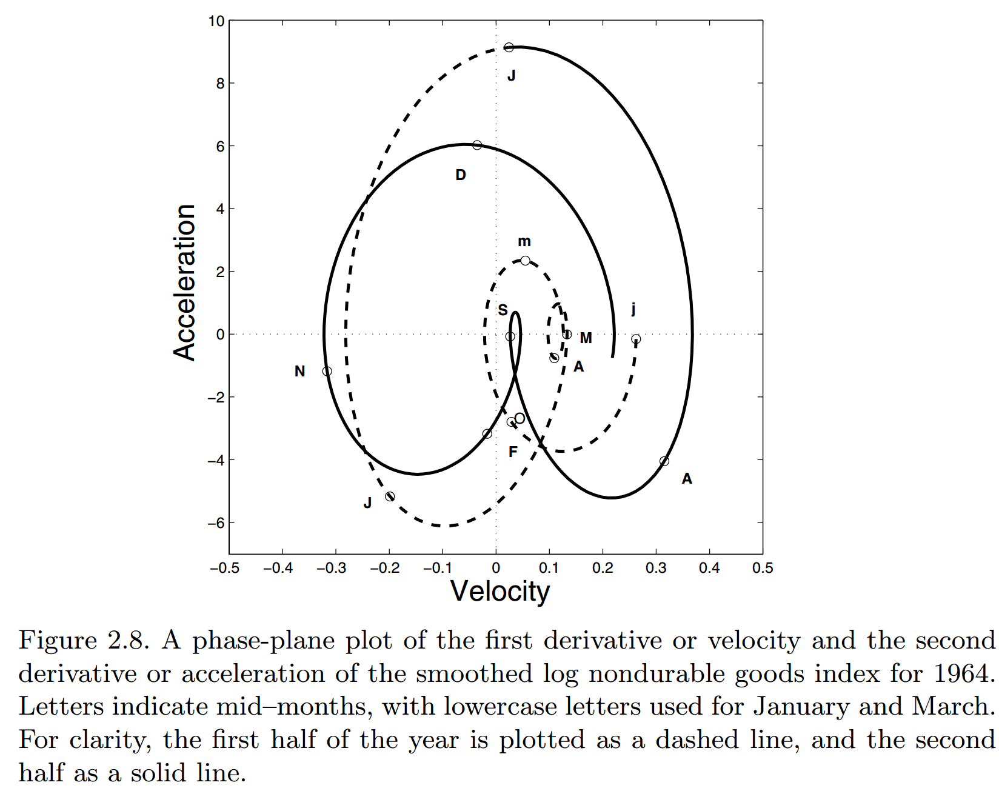
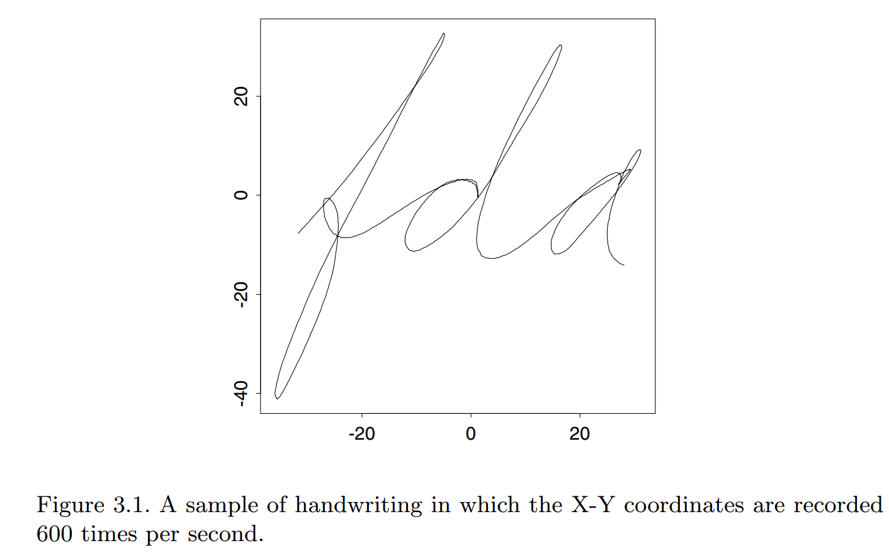
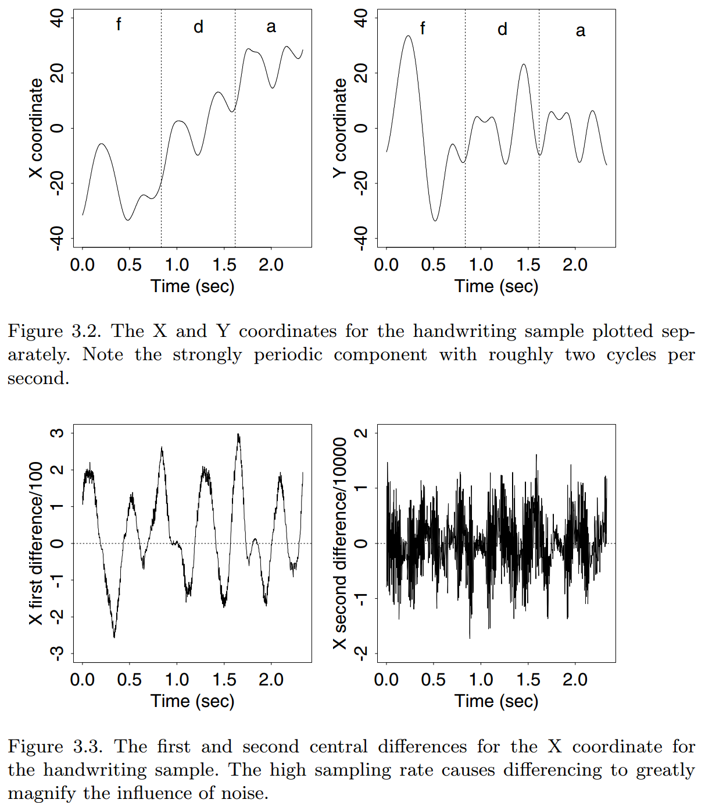
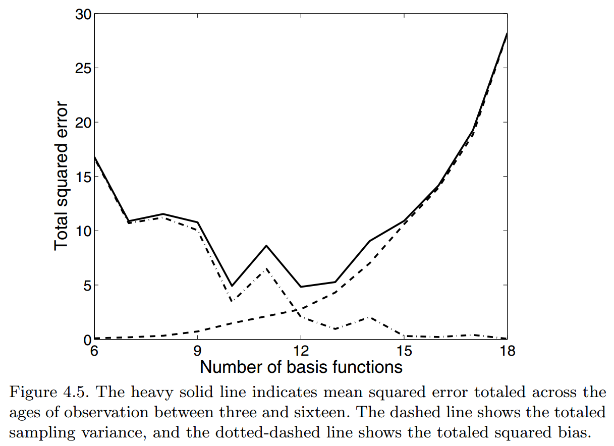

---
output:
  knitrBootstrap::bootstrap_document:
    title: "Functional Data Analysis Reading Notes (chap2-5)"
    theme: amelia
    highlight: sunburst
    theme.chooser: TRUE
    highlight.chooser: TRUE
---

# Chap2. Tools for exploring functional data

## 2.2 Some notation

- Derivatives and integrals: $D^mx \equiv \frac{d^mx}{dt^m}$.

  - $D^0x$ is $x$ itself

  - $D^{-1}x$ is the infinite integral of $x$

  - $D^1D^{-1}x = D^0x = x$

- Inner product for functions: $\langle x, y \rangle = \int x(t)y(t)dt$

  - Norm: $\|x\|^2 = \langle x, x \rangle = \int x^2(t)dt$

- Functions of functions: $x[h(t)] \equiv (x\circ h)(t)$

## 2.3 Summary statistics for functional data

- Mean function: $\bar{x}(t) = \frac{\sum_{i=1}^N x_i(t)}{N}$

- Variance function: $\text{var}_X(t) = \frac{\sum_{i=1}^N[x_i(t) - \bar{x}(t)]^2}{N-1}$

- Covariance function: $\text{cov}_X(t_1, t_2) = \frac{\sum_{i=1}^N\{x_i(t_1) - \bar{x}(t_1)\}\{x_i(t_2) - \bar{x}(t_2)\}}{N-1}$

- Correlation function: $\text{corr}_X(t_1, t_2) = \frac{\text{cov}_X(t_1, t_2)}{\sqrt{\text{var}_X(t_1)\text{var}_X(t_2)}}$

- Cross-covariance function: $\text{cov}_{X, Y}(t_1, t_2) = \frac{\sum_{i=1}^N\{x_i(t_1) - \bar{x}(t_1)\}\{y_i(t_2) - \bar{y}(t_2)\}}{N-1}$

- Correlation function: $\text{corr}_{X, Y}(t_1, t_2) = \frac{\text{cov}_{X, Y}(t_1, t_2)}{\sqrt{\text{var}_X(t_1)\text{var}_Y(t_2)}}$

## 2.5 Phase-plane plots of periodic effects

 

# Chap3. From functional data to somooth functions

## From discrete to functional data

$$y_j = x(t_j) + \epsilon_j$$

or in matrix notation

$$\mathbf{y} = x(\mathbf{t}) + \mathbf{e}$$

where $\text{Var}(\mathbf{y}) = \mathbf{\sigma}_e = \sigma^2\mathbf{I}$.

- In practice, functional data are usually observed and recorded discretely as $n$ pairs $(t_j, y_j)$, and $y_j$ is a snapshot of the function at time $t_j$, possibly blurred by measurement error.

- We will usually want to use the discrete data $y_j, j=1,...,n$ to estimate the function $x$ and at the same time a certain number of its derivatives.

  - For example, if we are tracking the position $x$ of a moving object such as a roket, we will want , also, to estimate its velocity $Dx$ and its acceleration $D^2x$.

- In general, we are concerned with a collection or sample of functional data, rather than just a single function $x$.
  
  - Specifically, the record or observation of the function $x_i$ might consist of $n_i$ pairs $(t_{ij}, y_{ij}), j=1,...,n_i$. $t_{ij}$ may vary from record to record.

  - Normally, the construction of the functional observations $x_i$ using the discrete data $y_{ij}$ takes place separately or independently for each record $i$.

- $\text{Var}(\mathbf{y})$ might have other structures, such as *autocorrelation*.

## The resolving power of data

- **resolution**: sampling rate

- **curvature**: The curvature of a function $x$ at argument $t$ is usually measured by the size of the second derivative as reflected in either $|D^2x(t)|$ or $[D^2x(t)]^2$.

- Where curvature is high, it is essential to have enough points to estimate the function effectively. But not the more the better.

- Example:

## Representing functions by basis functions

**A basis function system** is a set of known functions $\phi_k$ that are mathematically **independent** of each other and that have the property that we can approximate arbitrarily well **any** function by taking a weighted sum or linear combination of a sufficiently large number $K$ of these functions.

Basis function procedures represent a function $x$ by a linear expansion

$$x(t) = \sum_{k=1}^K c_k\phi_k(t) = \mathbf{c}^{'}\mathbf{\phi}(t)$$

in terms of $K$ known basis functions $\phi_k$.

Most functional data analyses these days involve either a **Fourier basis for periodic data, or a B-spline basis for non-periodic data**.

### Basis

- The Fourier basis are sine and cosine functions of increasing frequency:

$$1, sin(\omega t), cos(\omega t), sin(2\omega t), cos(2\omega t), ..., sin(m\omega t), cos(m\omega t), ...$$

- B-spline, with the following properties

  - Number of basis functions: **order + number interior knots** (also the case for splines)

  - Order $m$ splines: derivatives up to $m - 2$ are continuous

  - Support on $m$ adjacent intervals -- highly sparse design matrix.

- Constant: $\phi(t) = 1$

- Monomial: $1, x, x^2, x^3, ...$

- Power: $t^{\lambda_1}, t^{\lambda_2}, t^{\lambda_3}, ...$

- Exponential $e^{\lambda_1t}, e^{\lambda_2t}, e^{\lambda_3t}, ...$

- Wavelets, Empirical

## Spline functions and degree of freedom

- **breakpoints** vs. **knots**. *breakpoint* refers to the number
  of unique knot values, while the term *knot* refers to the
  sequence of values at breakpoints, where some breakpoints can be
  associated with multiple knots.

- The number of parameters required to define a spline function in the
  usual situation of one knot per breakpoint is  **the order plus the
  number of interior knots**.

# Chap4. Smoothing functional data by least squares

## Ordinary least squares estimates

Assume we have observations for a single curve

$$y_i = x(t_i) + \epsilon$$

and we want to estimate (determine the coefficients of the expansion $c_k$)

$$ x(t) \approx \sum_{k=1}^K c_k\phi_k(t)$$

by minimizing the least squared errors:

$$SSE(\mathbf{y}|\mathbf{c}) = \sum_{j=1}^n[y_j - \sum_{k=1}^K c_k\phi_k(t_j)]^2$$

- In matrix notation

$$SSE(\mathbf{y}|\mathbf{c}) = (\mathbf{y}-\mathbf{\phi}\mathbf{c})^{'}(\mathbf{y}-\mathbf{\phi}\mathbf{c})$$

where $\mathbf{c}$ is a vector of length $K$ and $\mathbf{\phi}$ is $n\times K$.

- The ordinary least squares estimate is $\hat{\mathbf{c}} = (\mathbf{\phi}^T\mathbf{\phi})^{-1}\mathbf{\phi}^T\mathbf{y}$

- Then we have the estimate $\hat{x}(t) = \mathbf{\phi}(t)\hat{\mathbf{c}}$

## Weighted least squares estimates

$$SSE(\mathbf{y}|\mathbf{c}) = (\mathbf{y}-\mathbf{\phi}\mathbf{c})^{'}\mathbf{\Sigma}_e^{-1}(\mathbf{y}-\mathbf{\phi}\mathbf{c})$$

$$\hat{\mathbf{c}} = (\mathbf{\phi}^T\mathbf{\Sigma}_e^{-1}\mathbf{\phi})^{-1}\mathbf{\phi}^T\mathbf{\Sigma}_e^{-1}\mathbf{y}$$

## Choosing the number $K$ of basis functions

- The bias/variance trade-off

$$MSE[\hat{x}(t)] = Bias^2[\hat{x}(t)] + Var[\hat{x}(t)]$$

- Stepwise variable selection

## Computing sampling variances and confidence limits

## Estimation $\mathbf{\Sigma}_e$

## Fitting data by localized least squares

- Idea: The value of the function estimate at a point $t$ must be
influenced mostly by the observations near $t$.

- Kernel smoothing

- Localized basis function estimators

- Local polynomial smoothing

# Chap5. Smoothing functional data with a roughness penalty

## Smoothing penalties

- Idea: adding penalties to avoid the estimated curve to be too
"roughness". Finesse this by specifying a very rich basis, but then
imposing smoothness.

- In particular, add a penalty to the least-squares criterion:

$$PENSSE_{\lambda}(x|\mathbf{y}) = (\mathbf{y} - x(\mathbf{t}))^T \mathbf{W} (\mathbf{y} - x(\mathbf{t}))  + \lambda \times \text{PEN}(x)$$

where $\text{PEN}(x)$ measures "roughness" of $x$.

- a natural measure of a function's roughness is the integrated squared second derivative

$$\text{PEN}(x) = \int [D^2 x(s)]^2 ds$$

- $\lambda$ represents a continuous tuning parameter (to be chosen):

  - $\lambda \rightarrow \infty$: roughness increasingly penalized, $x(t)$ becomes smooth.

  - $\lambda \rightarrow 0$: penalty reduces, $x(t)$ fits data better
  

## The structure of a smoothing spline

- A remarkable theorem, found in de Boor (2002) and other more advanced
texts on smoothing, states that the curve $x$ that minimizes $\text{PENSSE}_{\lambda}(x|y)$ is a cubic spline with knots at the data points $t_j$.

- The most common computational technique for spline smoothing is to
  use an order four B-spline basis function expansion with knots at
  the sampling points. The method is often referred to as **cubic spline smoothing**

## Calculating the Penalized Fit

- Recall that, without roughness penalty, the coefficient vector $\mathbf{c}$ in the expansion

$$x(t) = \phi(t)^T \mathbf{c}$$

has the solution

$$\hat{\mathbf{c}} = (\mathbf{\phi}^T\mathbf{W}\mathbf{\phi})^{-1}\mathbf{\phi}^T\mathbf{W}\mathbf{y}$$

- re-express the roughness penalty in matrix terms as

$$\int [D^m x(s)]^2 ds = \int \mathbf{c}^T[D^m\phi(s)][D^m\phi(s)]^T\mathbf{c}ds = \mathbf{c}^T\mathbf{R}\mathbf{c}$$

- the penalized least squares estimate for $\mathbf{c}$ 

$$\hat{\mathbf{c}} = (\mathbf{\phi}^T\mathbf{W}\mathbf{\phi} + \lambda \mathbf{R})^{-1}\mathbf{\phi}^T\mathbf{W}\mathbf{y}$$

- This is still a linear smoother:

$$\hat{\mathbf{y}} = \mathbf{\phi}(\mathbf{\phi}^T\mathbf{W}\mathbf{\phi} + \lambda \mathbf{R})^{-1}\mathbf{\phi}^T\mathbf{W}\mathbf{y} = \mathbf{S}(\lambda)\mathbf{y}$$

## More General Smoothing Penalties

- $D^2x(t)$ is only one way to measure the roughness of x.

- If we were interested in $D^2x(t)$, we might penalize $D^4x(t)$

- If we are analyzing periodic data, it would be more natural to use the **harmonic acceleration** operator

$$L_x = D^3x + \omega^2 Dx$$

## Linear Smooths and Degrees of Freedom

- In least squares fitting, the degrees of freedom used to smooth
the data is exactly $K$, the number of basis functions

- In penalized smoothing, we can have $K > n$. The smoothing penalty
reduces the flexibility of the smooth The degrees of freedom are
controlled by $\lambda$. A natural measure turns out to be

$$df(\lambda) = \text{trace}[\mathbf{S}(\lambda)]$$

## Choosing Smoothing Parameters: Cross Validation

There are a number of data-driven methods for choosing smoothing
parameters.

- Ordinary Cross Validation

- Generalized Cross Validation

$$\text{GCV}(\lambda) = \frac{\sum (y_i - x_{\lambda}(t_i))^2}{[\text{trace}(\mathbf{I} - \mathbf{S}(\lambda))]^2}$$

- Other possibilities: AIC, BIC
